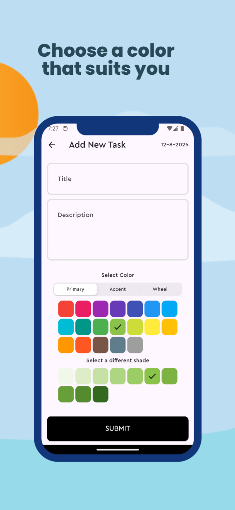

### 📝 TaskWise
A simple **Flutter** project demonstrating **Clean Architecture**, **Offline-First approach**, and **BLoC state management**, with **Supabase** for backend + authentication.

---

#### 🚀 Features
- Add tasks for a selected date
- Edit/Delete tasks
- Fully offline-first (local DB sync)
- Clean and scalable architecture
- Authentication (email/password)
- Cross-platform (Android/iOS/Web)

---

####  🏛️ Architecture
This project follows **Clean Architecture**, separating the codebase into clear layers:

    lib/
     ├─ core/
     │   ├─ error/
     │   ├─ usecase/
     │   └─ utils/
     │
     ├─ features/
     │   └─ tasks/
     │       ├─ data/
     │       │   ├─ datasources/
     │       │   ├─ models/
     │       │   └─ repositories/
     │       ├─ domain/
     │       │   ├─ entities/
     │       │   ├─ repositories/
     │       │   └─ usecases/
     │       └─ presentation/
     │           ├─ bloc/
     │           ├─ pages/
     │           └─ widgets/
     │
     ├─ services/
     │   └─ supabase_service.dart
     │
     └─ main.dart

---

#### 🧱 Tech Stack
<table style="margin-top:0; padding-top:0;">
   <tr>
      <th>Technology</th>
      <th>Description</th>
   </tr>
   <tr>
      <td style="display:flex; align-items:center; gap:10px;">
         
         <b>Flutter</b>
      </td>
      <td>A cross-platform UI framework used to build the app.</td>
   </tr>
   <tr>
      <td style="display:flex; align-items:center; gap:10px;">
         
         <b>Supabase</b>
      </td>
      <td>Backend service providing database, authentication, and API.</td>
   </tr>
   <tr>
      <td style="display:flex; align-items:center; gap:10px;">
         
         <b>Bloc</b>
      </td>
      <td>State management solution used for handling business logic.</td>
   </tr>
   <tr>
      <td style="display:flex; align-items:center; gap:10px;">
         
         <b>PostgreSQL</b>
      </td>
      <td>Database is a relational database</td>
   </tr>
      <tr>
      <td style="display:flex; align-items:center; gap:10px;">
         
         <b>Hive</b>
      </td>
      <td>Local storage and caching</td>
   </tr>
</table>

---

#### 📷 Screenshots

    
    

The mockups are made from https://previewed.app/

